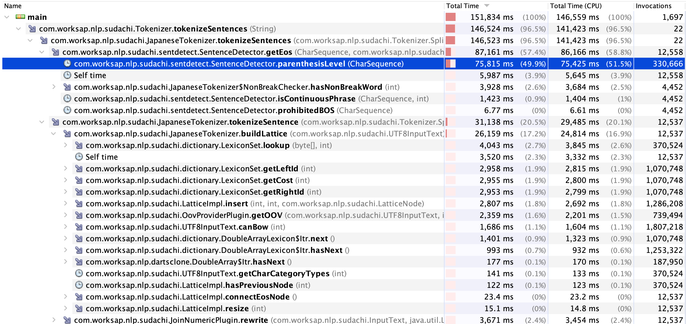

改行が多く含まれた文章に対してSudachiによる形態素解析を行うと非常に遅くなる場合がある。
その状態を再現するためのコード。

system_core.dicだけapp/src/main/resourcesに入れる必要がある

# 再現コード1
SudachiPerfTest.java
通常の文章、1文字ごとにスペース区切りの文章、1文字ごとに改行区切りの文章に対して、tokenizeSentencesを100回行うコード。
```
plain text
8434ms
----------------------
space separated text. length:8822
5459ms
----------------------
space separated text. length:17644
12029ms
----------------------
newline separated text. length:8822
94093ms
----------------------
newline separated text. length:17644
478105ms
----------------------
```
プロファイリングをしてみると、parenthesisLevelメソッドが遅そう。



# 再現コード3
RegexTest.java
下記SentenceDetectorのうち、SENTENCE_BREAKER_PATTERNにマッチする文字が存在しない場合の処理時間比較
https://github.com/WorksApplications/Sudachi/blob/develop/src/main/java/com/worksap/nlp/sudachi/sentdetect/SentenceDetector.java#L122
1文字ごとにスペース区切りの文章、1文字ごとに改行区切りの文章に対して正規表現による文分割を行っている
通常の文章は改行がなく、句点での文分割が行われているので計測していない

以下の通り、spaceとnewlineで処理時間に差がある。
また、newlineの場合は文字列長に応じて処理時間が増大する
```
space separated text. length:8822
39ms
----------------------
space separated text. length:17644
25ms
----------------------
space separated text. length:88220
19ms
----------------------
newline separated text. length:8822
809ms
----------------------
newline separated text length:17644
1838ms
----------------------
newline separated text length:88220
41810ms
----------------------
```


# 計測条件
* MacBook Pro (15-inch, 2017)
* 2.8 GHz クアッドコアIntel Core i7
* 16 GB 2133 MHz LPDDR3
* OpenJDK 64-Bit Server VM AdoptOpenJDK (build 11.0.6+10, mixed mode)